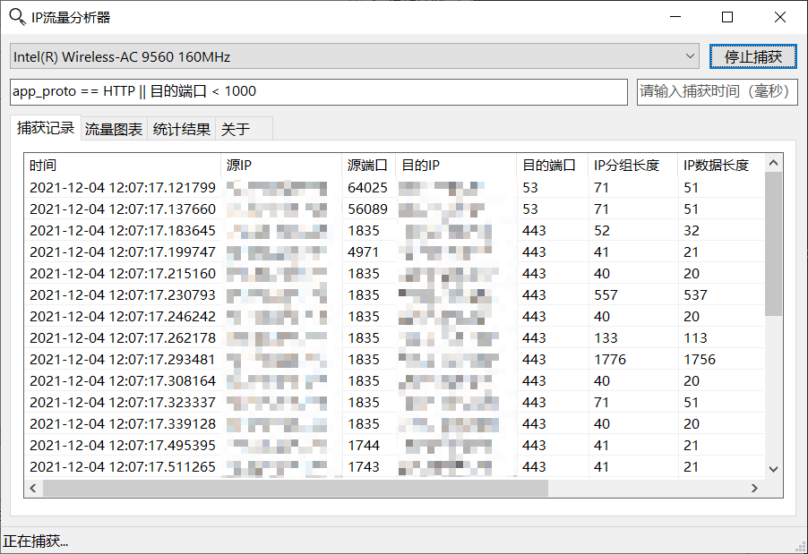
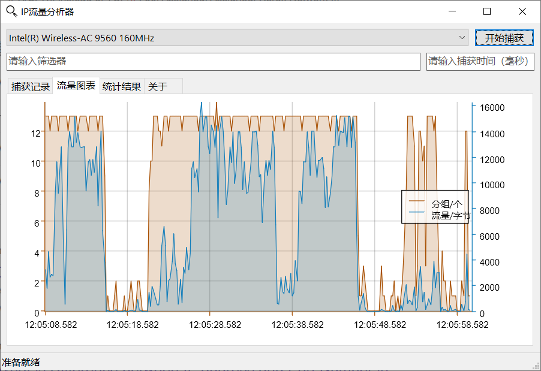
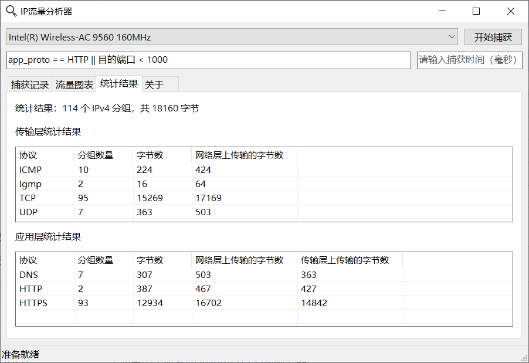
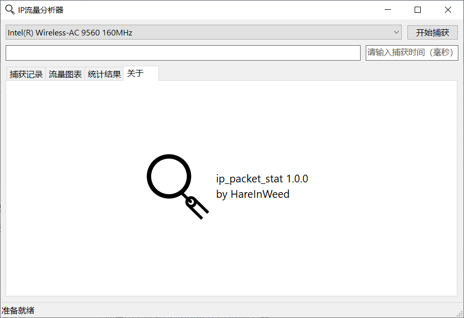

# IPv4 Packet Statistics Tool

An IPv4 packet statistics tool built with Winsock2.

**Notice: This is a homework project, use it at your own risk.**

## TODO List

- [x] IPv4 packet capture
- [x] packet filter
  - [ ] better time literal
  - [ ] clear error message
- [x] realtime packet list
- [x] realtime capture summary table
- [x] realtime throughput chart
  - [ ] better plotting when filtering by time
- [ ] config panel
- [ ] cross-platform
  - [ ] replace `socket2` with `libpnet`
  - [ ] cross-platform gui implementation 
- [ ] i18n

## Showcase

## LICENSE

MIT
